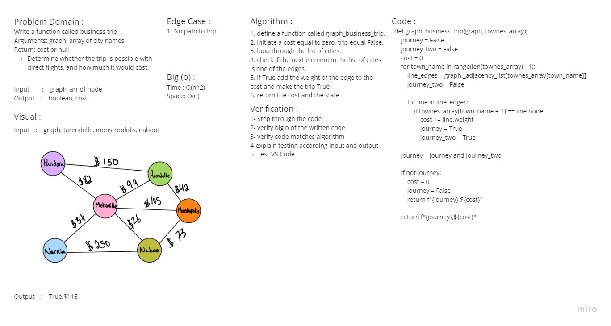

# Graphs
<!-- Short summary or background information -->
## A graph is a non-linear data structure that can be looked at as a collection of vertices (or nodes) potentially connected by line segments named edges

## Challenge
<!-- Description of the challenge -->
### Features

> Implement your own Graph. The graph should be represented as an adjacency list, and should include the following methods:

* add node
  * Arguments: value
  * Returns: The added node
  * Add a node to the graph
* add edge
  * Arguments: 2 nodes to be connected by the edge, weight (optional)
  * Returns: nothing
  * Adds a new edge between two nodes in the graph
  * If specified, assign a weight to the edge
  * Both nodes should already be in the Graph
* get nodes
  * Arguments: none
  * Returns all of the nodes in the graph as a collection (set, list, or similar)
* get neighbors
  * Arguments: node
  * Returns a collection of edges connected to the given node
  * Include the weight of the connection in the returned collection
* size
  * Arguments: none
  * Returns the total number of nodes in the graph

## Approach & Efficiency
<!-- What approach did you take? Why? What is the Big O space/time for this approach? -->
* add_node:
  * time `O(1)`
  * space `O(1)`
  
* add_edge:
  * time `O(n)`
  * space `O(n)`

* get_nodes:
  * time `O(n)`
  * space `O(n)`

* get_neighbors:
  * time `O(n)`
  * space `O(n)`

* size:
  * time `O(1)`
  * space `O(1)`

## API
<!-- Description of each method publicly available in your Graph -->
* `add node`: Add a node to the graph, Arguments: value , Returns: The added node
* `add edge`: Adds a new edge between two nodes in the graph If specified, assign a weight to the edge Both nodes should already be in the Graph ,Arguments: 2 nodes to be connected by the edge, weight (optional) , Returns: nothing
* `get nodes`: Returns all of the nodes in the graph as a collection (set, list, or similar)
* `get neighbors`: Returns a collection of edges connected to the given node , Include the weight of the connection in the returned collection
* `size`: Returns the total number of nodes in the graph

# Graphs
<!-- Short summary or background information -->
## A graph is a non-linear data structure that can be looked at as a collection of vertices (or nodes) potentially connected by line segments named edges

## PR Description Section

| Table Of Content              | Links                                                                                                |
| ----------------------------- | ---------------------------------------------------------------------------------------------------- |
| PR '1' > Graph Implementation | [PR '1' > Graph](https://github.com/YousefAbuJalboush/data-structures-and-algorithms-python/pull/40) |
| PR '2' > Breadth-First | [PR '2' > Breadth-First](https://github.com/YousefAbuJalboush/data-structures-and-algorithms-python/pull/42) |

## Challenge
<!-- Description of the challenge -->
### Features

> Implement your own Graph. The graph should be represented as an adjacency list, and should include the following methods:

* add node
  * Arguments: value
  * Returns: The added node
  * Add a node to the graph
* add edge
  * Arguments: 2 nodes to be connected by the edge, weight (optional)
  * Returns: nothing
  * Adds a new edge between two nodes in the graph
  * If specified, assign a weight to the edge
  * Both nodes should already be in the Graph
* get nodes
  * Arguments: none
  * Returns all of the nodes in the graph as a collection (set, list, or similar)
* get neighbors
  * Arguments: node
  * Returns a collection of edges connected to the given node
  * Include the weight of the connection in the returned collection
* size
  * Arguments: none
  * Returns the total number of nodes in the graph

## Approach & Efficiency
<!-- What approach did you take? Why? What is the Big O space/time for this approach? -->
* add_node:
  * time `O(1)`
  * space `O(1)`
  
* add_edge:
  * time `O(n)`
  * space `O(n)`

* get_nodes:
  * time `O(n)`
  * space `O(n)`

* get_neighbors:
  * time `O(n)`
  * space `O(n)`

* size:
  * time `O(1)`
  * space `O(1)`

## API
<!-- Description of each method publicly available in your Graph -->
* `add node`: Add a node to the graph, Arguments: value , Returns: The added node
* `add edge`: Adds a new edge between two nodes in the graph If specified, assign a weight to the edge Both nodes should already be in the Graph ,Arguments: 2 nodes to be connected by the edge, weight (optional) , Returns: nothing
* `get nodes`: Returns all of the nodes in the graph as a collection (set, list, or similar)
* `get neighbors`: Returns a collection of edges connected to the given node , Include the weight of the connection in the returned collection
* `size`: Returns the total number of nodes in the graph

# Challenge Summary - breadth-first
<!-- Description of the challenge -->
## Implement a breadth-first traversal on a graph.

## Feature Tasks

### Write the following method for the Graph class:

* breadth first
* Arguments: Node
* Return: A collection of nodes in the order they were visited.
* Display the collection

## Whiteboard Process
<!-- Embedded whiteboard image -->

## Approach & Efficiency
<!-- What approach did you take? Why? What is the Big O space/time for this approach? -->
* time: `O(n^2)`
* space: `O(n)`

## Solution
<!-- Show how to run your code, and examples of it in action -->
| Table Of Content | Links                                |
| ---------------- | ------------------------------------ |
| Graph            | [Graph.py](graph/graph.py)           |
| Test Graph       | [test_graph.py](tests/test_graph.py) |

# Challenge Summary - Graph Business Trip
<!-- Description of the challenge -->
## Given a business trip itinerary, and an Alaska Airlines route map, is the trip possible with direct flights? If so, how much will the total trip cost be?

### Feature Tasks

* Write a function called business trip
* Arguments: graph, array of city names
* Return: cost or null

> Determine whether the trip is possible with direct flights, and how much it would cost.

## Whiteboard Process
<!-- Embedded whiteboard image -->

## Approach & Efficiency
<!-- What approach did you take? Why? What is the Big O space/time for this approach? -->
* time: `O(n^2)`
* space: `O(1)`

## Solution
<!-- Show how to run your code, and examples of it in action -->
| Table Of Content         | Links                                                            |
| ------------------------ | ---------------------------------------------------------------- |
| Graph Business Trip      | [graph_business_trip.py](graph/graph_business_trip.py)           |
| Test Graph Business Trip | [test_graph_business_trip.py](tests/test_graph_business_trip.py) |

# Challenge Summary - Graph Depth First
<!-- Description of the challenge -->
## Conduct a depth first preorder traversal on a graph

### Feature Tasks

#### Write the following method for the Graph class:

* depth first
* Arguments: Node (Starting point of search)
* Return: A collection of nodes in their pre-order depth-first traversal order
* Display the collection

## Whiteboard Process
<!-- Embedded whiteboard image -->

## Approach & Efficiency
<!-- What approach did you take? Why? What is the Big O space/time for this approach? -->
* time: `O(n^2)`
* space: `O(n)`

## Solution
<!-- Show how to run your code, and examples of it in action -->
| Table Of Content | Links                                         |
| ---------------- | --------------------------------------------- |
| Graph            | [Graph.py](graph/graph.py)                    |
| Test Depth First | [test_depth_first](tests/test_depth_first.py) |