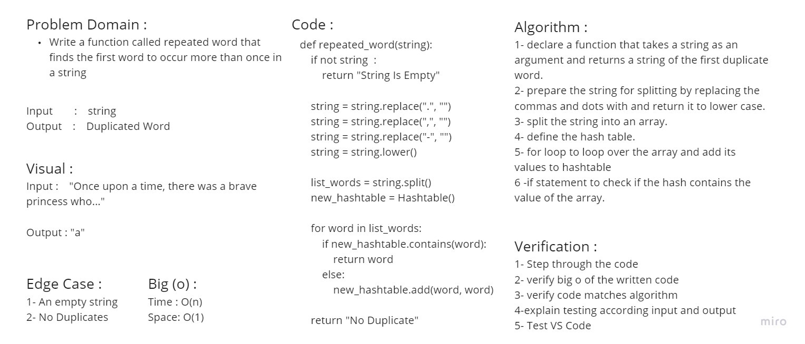

# Hashtables
<!-- Short summary or background information -->
### Hashing is a technique that is used to uniquely identify a specific object from a group of similar objects

# Challenge
<!-- Description of the challenge -->
### Implement a Hashtable Class

## Approach & Efficiency
<!-- What approach did you take? Why? What is the Big O space/time for this approach? -->
* add:
  * time `O(1)`
  * space `O(1)`
* get:
  * time `O(1)`
  * space `O(1)`
* contains:
  * time `O(1)`
  * space `O(1)`
* hash:
  * time `O(n)`
  * space `O(1)`

## API
<!-- Description of each method publicly available in each of your hashtable -->
* add
  * Arguments: key, value
  * Returns: nothing
  * This method should hash the key, and add the key and value pair to the table, handling collisions as needed.
* get
  * Arguments: key
  * Returns: Value associated with that key in the table
* contains
  * Arguments: key
  * Returns: Boolean, indicating if the key exists in the table already.
* hash
  * Arguments: key
  * Returns: Index in the collection for that key

## Solution
<!-- Show how to run your code, and examples of it in action -->
| Table Of Content                               | Links                                       |
| ---------------------------------------------- | ------------------------------------------- |
| HashTable                                      | [hash_table.py](hash_table/hash_table.py)|
| Test HashTable                                 | [test_hash_table.py](tests/test_hash_table.py)|

# Challenge Summary - Code Challenge: Class 31
<!-- Description of the challenge -->
### Write a function called repeated word that finds the first word to occur more than once in a string

## Whiteboard Process
<!-- Embedded whiteboard image -->

## Approach & Efficiency
<!-- What approach did you take? Why? What is the Big O space/time for this approach? -->
* time `O(n)`
* space `O(1)`

## Solution
<!-- Show how to run your code, and examples of it in action -->
| Table Of Content                               | Links                                       |
| ---------------------------------------------- | ------------------------------------------- |
| repeated_word                                  | [repeated_word.py](hashtable/repeated_word.py)|
| test_repeated_word                             | [test_repeated_word.py](tests/test_repeated_word.py)|
