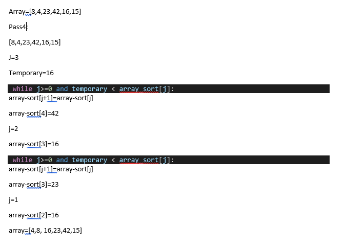

# Insertion Sort

Insertion Sort is a sorting algorithm in the same family as bubble sort and selection sort. Insertion sort works by iterating across the array starting at the front and comparing if the value of the element next to it is lower. If the next door value is lower the elements change places.

### Pseudocode
```
  InsertionSort(int[] arr)

    FOR i = 1 to arr.length

      int j <-- i - 1
      int temp <-- arr[i]

      WHILE j >= 0 AND temp < arr[j]
        arr[j + 1] <-- arr[j]
        j <-- j - 1

      arr[j + 1] <-- temp
```


## Trace

### Pass 1


first pass, we found the smallest number in index No. 1, then a function based on storing this number in the temporary variable after that to replace the place of the smaller number with the larger number and put the smallest number in the array first

### Pass 2


The second pass through the array evaluates the remaining values in the array to see if there is a smaller value other than the current position of i. 8 is the second smallest number in the array, to swaps with itself. The minimum value does not change at all during the iteration of this pass.


### Pass 3


The third pass through evaluates the remaining indexes in the array, starting at position 2. Both position 4 and 5 are smaller than the value in position 2. Each time a smaller number than the current minimum is found, the variable will update to the new smallest number. In this case, 15 is the next smallest number. As a result, it will swap with position 2.

### Pass 4



The 4th pass through on the array shows  that 16 is the next smallest number in the array, and as a result, switches places with the number 42.

### Pass 5


The 5th pass through of the array only has one other index to evaluate. Since the last index value is larger than index 4, the two numbers  will swap.


### Pass 6


at the final loop the array will compare the values against itself
the  i will increment to number 6 to force to breakout of the outer loop  and leave it to a sorted array 

### Efficency

  Time: O(n^2)
      The basic operation of this algorithm is comparison. This will happen n * (n-1) number of times…concluding the algorithm to be n squared.
  Space: O(1)
      No additional space is being created. This array is being sorted in place…keeping the space at constant O(1).