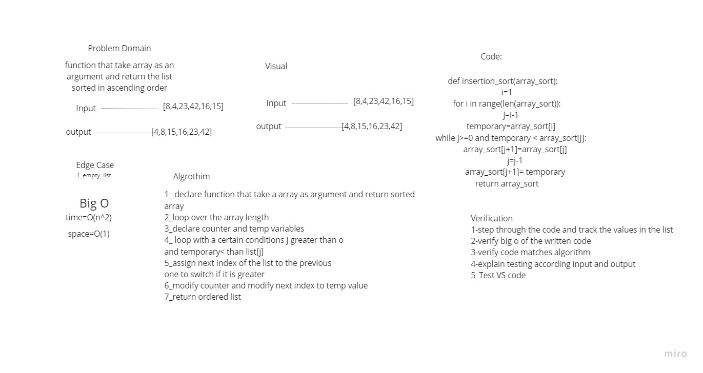

## Challenge Summary
- create function that sort an array ascending 

## Whiteboard Process

## Approach & Efficiency
- time O(n2)  
- space O(1)

## Solution
<!-- Show how to run your code, and examples of it in action -->

| Table Of Content                               | Links                                       |
| ---------------------------------------------- | ------------------------------------------- |
| insertion                         | [insertion_sort.py](insertion_sort/insertion_sort.py)                  |
| test_insertion                    | [test_insertion_sort.py](tests/test_insertion_sort.py)        |