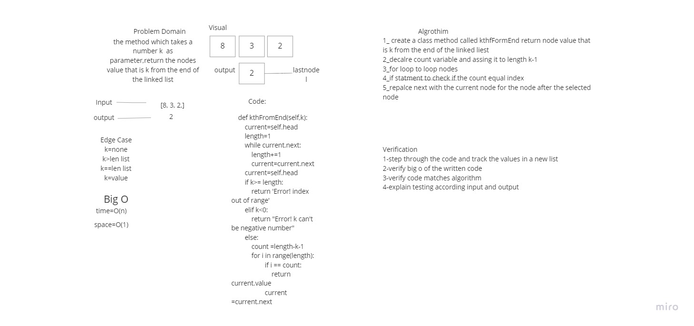
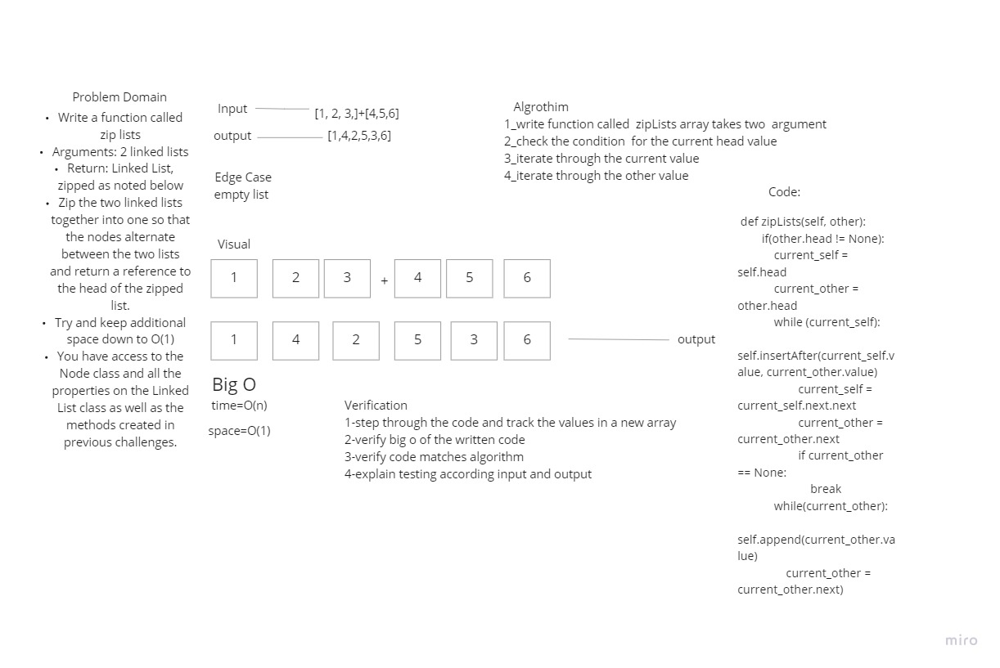

# Singly Linked List
<!-- Short summary or background information -->
* A singly linked list is a type of linked list that is unidirectional, that is, it can be traversed in only one direction from head to the last node (tail). Each element in a linked list is called a node. A single node contains data and a pointer to the next node which helps in maintaining the structure of the list.
## Challenge
<!-- Description of the challenge -->
* Create a Node class that has properties for the value stored in the Node, and traversed on it and doing some function
## Approach & Efficiency
<!-- What approach did you take? Why? What is the Big O space/time for this approach? -->
* learn a lot about LinkedList how to deal with it and traversed throw it
## API
<!-- Description of each method publicly available to your Linked List -->
### The class should contain the following methods
#### insert
* Arguments: value
* Returns: nothing
* Adds a new node with that value to the head of the list with an O(1) Time performance.
#### includes
*Arguments: value
*Returns: Boolean
*Indicates whether that value exists as a Node's value somewhere within the list.
### to string
* Arguments: none
* Returns: a string representing all the values in the Linked List, formatted as:
* "{ a } -> { b } -> { c } -> NULL"

| Table Of Content                               | Links                                       |
| ---------------------------------------------- | ------------------------------------------- |
| linked_list                                    | [linked_list.py](linked_list/linked_list.py)|
| test_linked_list                               | [test_linked_list.py](tests/test_linked_list.py)|

# Challenge '2' :
## #Challenge Summary
<!-- Description of the challenge -->
* append
      - arguments: new value
      - adds a new node with the given value to the end of the list
* insert before
      - arguments: value, new value
      - adds a new node with the given new value immediately before the first node that has the value specified
* insert after
      - arguments: value, new value
      - adds a new node with the given new value immediately after the first node that has the value specified
<!-- ### Whiteboard Process -->
<!-- Embedded whiteboard image -->
### Approach & Efficiency
<!-- What approach did you take? Why? What is the Big O space/time for this approach? -->
#### Write tests to prove the following functionality:
* Can successfully add a node to the end of the linked list
* Can successfully add multiple nodes to the end of a linked list
* Can successfully insert a node before a node located i the middle of a linked list
* Can successfully insert a node before the first node of a linked list
* Can successfully insert after a node in the middle of the linked list
* Can successfully insert a node after the last node of the linked list
### Solution
<!-- Show how to run your code, and examples of it in action -->
| Table Of Content                               | Links                                       |
| ---------------------------------------------- | ------------------------------------------- |
| linked_list                                    | [linked_list.py](linked_list/linked_list.py)|
| test_linked_list                               | [test_linked_list.py](tests/test_linked_list.py)|

# Challenge '3' :
## #Challenge Summary
<!-- Description of the challenge -->
* kth from end
* argument: a number, k, as a parameter.
* Return the node’s value that is k places from the tail of the linked list.
* You have access to the Node class and all the properties on the Linked List class as well as the methods * created in previous challenges.

### Approach & Efficiency
<!-- What approach did you take? Why? What is the Big O space/time for this approach? -->
#### Write tests to prove the following functionality:
* Where k is greater than the length of the linked list
* Where k and the length of the list are the same
* Where k is not a positive integer
* Where the linked list is of a size 1
* “Happy Path” where k is not at the end, but somewhere in the middle of the linked list
### Solution
<!-- Show how to run your code, and examples of it in action -->
| Table Of Content                               | Links                                       |
| ---------------------------------------------- | ------------------------------------------- |
| linked_list                                    | [linked_list.py](linked_list/linked_list.py)|
| test_linked_list                               | [test_linked_list.py](tests/test_linked_list.py)|

# Challenge '4' :
## #Challenge Summary
<!-- Description of the challenge -->
* Write a function called zip lists
* Arguments: 2 linked lists
* Return: Linked List, zipped as noted below
* Zip the two linked lists together into one so that the nodes alternate between the two lists and return a  reference to the head of the zipped list.
* Try and keep additional space down to O(1)

<!-- ### Whiteboard Process -->

<!-- Embedded whiteboard image -->
### Approach & Efficiency
<!-- What approach did you take? Why? What is the Big O space/time for this approach? -->
#### Write tests to prove the following functionality:
* Where list is empty
* Where list1 is empty
* Where list2 is empty
* Where  the lists the same length 
### Solution
<!-- Show how to run your code, and examples of it in action -->
| Table Of Content                               | Links                                       |
| ---------------------------------------------- | ------------------------------------------- |
| linked_list                                    | [linked_list.py](linked_list/linked_list.py)|
| test_linked_list                               | [test_linked_list.py](tests/test_linked_list.py)|

