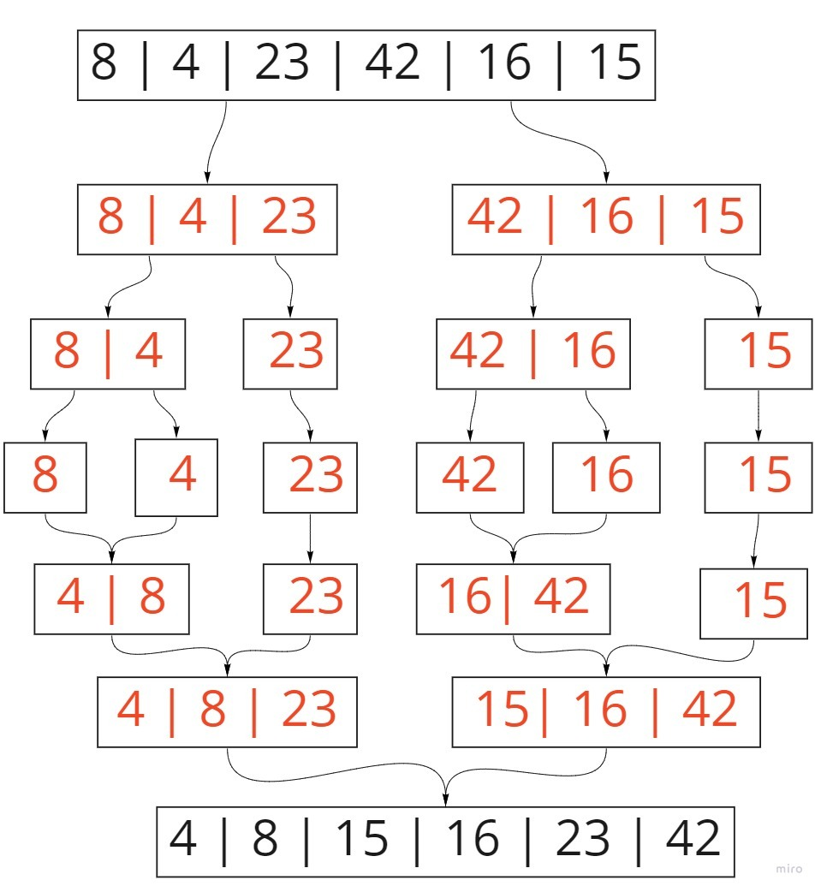

# Merge Sort

## Description
Merge sort is a divide and conquer sorting algorithm. It recursiveley splits each portion of the origin array until it's comparing only two arrays with a single element each. It then merges the sorted subarrays back together.

## Pseudocode

```py
ALGORITHM Mergesort(arr)
    DECLARE n <-- arr.length

    if n > 1
      DECLARE mid <-- n/2
      DECLARE left <-- arr[0...mid]
      DECLARE right <-- arr[mid...n]
      // sort the left side
      Mergesort(left)
      // sort the right side
      Mergesort(right)
      // merge the sorted left and right sides together
      Merge(left, right, arr)

ALGORITHM Merge(left, right, arr)
    DECLARE i <-- 0
    DECLARE j <-- 0
    DECLARE k <-- 0

    while i < left.length && j < right.length
        if left[i] <= right[j]
            arr[k] <-- left[i]
            i <-- i + 1
        else
            arr[k] <-- right[j]
            j <-- j + 1

        k <-- k + 1

    if i = left.length
       set remaining entries in arr to remaining values in right
    else
       set remaining entries in arr to remaining values in left

```      
# Trace


### Input: [8, 4, 23, 42, 16, 15]


# pass1:
## divides the input array into two halves by finding the mid of the array then started from left side to diveds the arrays until the lenght of the array becoumes 1, then we start merging , start with the last left array and last right array  , next we go through the while loop to check the conditon , so yes the index 0 of arr == left[0]==4 then i++ , then goes through the while again , and its return false so we out from whiles , array_index++, i < len(left): so will return [4,23]

# pass2:
## then we merge the left from divid 2 with the return array from pass1 as we said before

# pass3:
## start with the secand half , merging the last left array(16) and last right array(15) ,next we go through the while loop and so on , will return [15,16]

# pass4:
## then we merge the left from divid 2 with the return array from pass2 as we said before

# pass5:
## do as we did befor until we get the final result sorted array 


## Efficency
- Time: O(n log(n))


- Space: O(n)