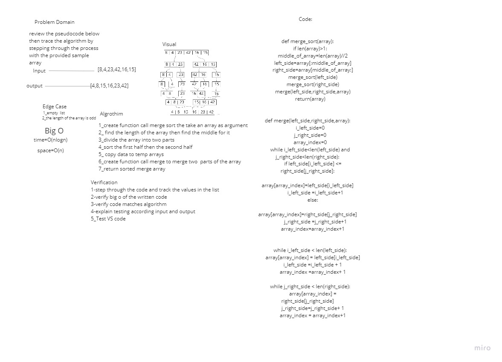

# Challenge Summary
<!-- Description of the challenge -->
### Review the pseudocode below, then trace the algorithm by stepping through the process with the provided sample array. Document your explanation by creating a blog article that shows the step-by-step output after each iteration through some sort of visual.
```py
ALGORITHM Mergesort(arr)
    DECLARE n <-- arr.length

    if n > 1
      DECLARE mid <-- n/2
      DECLARE left <-- arr[0...mid]
      DECLARE right <-- arr[mid...n]
      // sort the left side
      Mergesort(left)
      // sort the right side
      Mergesort(right)
      // merge the sorted left and right sides together
      Merge(left, right, arr)

ALGORITHM Merge(left, right, arr)
    DECLARE i <-- 0
    DECLARE j <-- 0
    DECLARE k <-- 0

    while i < left.length && j < right.length
        if left[i] <= right[j]
            arr[k] <-- left[i]
            i <-- i + 1
        else
            arr[k] <-- right[j]
            j <-- j + 1

        k <-- k + 1

    if i = left.length
       set remaining entries in arr to remaining values in right
    else
       set remaining entries in arr to remaining values in left
```

## Whiteboard Process
<!-- Embedded whiteboard image -->


## Approach & Efficiency
<!-- What approach did you take? Why? What is the Big O space/time for this approach? -->
* Time : `O(nlogn)`
* Space: `O(n)`


## Solution
<!-- Show how to run your code, and examples of it in action -->
| Table Of Content                               | Links                                       |
| ---------------------------------------------- | ------------------------------------------- |
| merge_sort                                     | [merge_sort.py](merge_sort/merge_sort.py)|
| test_merge_sort                                | [test_merge_sort.py](tests/test_merge_sort.py)|
| BLOG                                           | [BLOG.md](BLOG.md)|