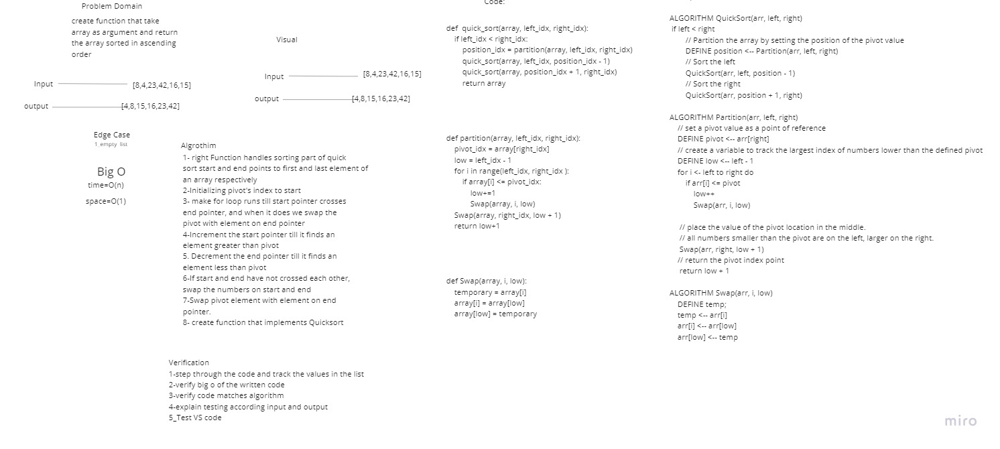

# QuickSort

quick sorting array 

## Challenge

Review the pseudocode below, then trace the algorithm by stepping through the process with the provided sample array. Document your explanation by creating a blog article that shows the step-by-step output after each iteration through some sort of visual.
Once you are done with your article, code a working, tested implementation of Quick Sort based on the pseudocode provided.

## Whiteboard Process

## Approach & Efficiency
Time: O(n^2)
Space: O(log(n))

## Solution
<!-- Show how to run your code, and examples of it in action -->
| Table Of Content                               | Links                                       |
| ---------------------------------------------- | ------------------------------------------- |
| quick_sort                                     | [quick_sort.py](quick_sort/quick_sort.py)|
| test_quick_sort                                | [test_merge_sort.py](tests/test_merge_sort.py)|
| BLOG                                           | [BLOG.md](BLOG.md)|