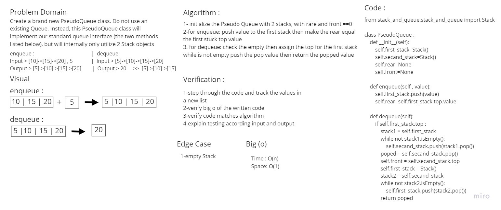

# Code Challenge: Class 10 : Stacks and Queues
<!-- Short summary or background information -->
### A stack is a data structure that consists of Nodes. Each Node references the next Node in the stack, but does not reference its previous
### Queue is a container of objects (a linear collection) that are inserted and removed according to the first-in first-out (FIFO) principle
## Challenge
<!-- Description of the challenge -->
### Create stack and queue classes and add to stack push, pop, peek and is empty methods. and for queue enqueue, dequeue, peek and is empty methods
## Approach & Efficiency
<!-- What approach did you take? Why? What is the Big O space/time for this approach? -->
### Stacks
* push >>> O(1)
* pop >>> O(1)
* peek >>> O(1)
* is_empty >>> O(1)
### Queues
* enqueue >>> O(1)
* dequeue >>> O(1)
* peek >>> O(1)
* is_empty >>> O(1)
## API
<!-- Description of each method publicly available to your Stack and Queue-->
### Stacks
* ` push `to push onto a stack and  push multiple values onto a stack
* `pop` to pop off the stack or empty a stack after multiple pops
* `peek` you will view the value of the top Node in the stack. When you attempt to peek an empty stack an exception will be raised.
* `is_empty` returns true when stack is empty otherwise returns false.
### Queues
* `enqueue` Nodes or items that are added to the queue.
* `dequeue` Nodes or items that are removed from the queue. If called when the queue is empty an exception will be raised.
* `peek` When you peek you will view the value of the front Node in the queue. If called when the queue is empty an exception will be raised.
* `is_empty` returns true when queue is empty otherwise returns false.

### Solution
<!-- Show how to run your code, and examples of it in action -->
| Table Of Content                               | Links                                       |
| ---------------------------------------------- | ------------------------------------------- |
| stack_and_queue                                    | [stack_and_queue.py](stack_and_queue/stack_and_queue.py)|
| test_stack_and_queue                               | [test_stack_and_queue.py](tests/test_stack_and_queue.py)|

# Code Challenge: Class 11 : stack queue pseudo
<!-- Description of the challenge -->
### Create a brand new PseudoQueue class. Do not use an existing Queue. Instead, this PseudoQueue class will implement our standard queue interface (the two methods listed below), but will internally only utilize 2 Stack objects

## Whiteboard Process
<!-- Embedded whiteboard image -->

## Approach & Efficiency
<!-- What approach did you take? Why? What is the Big O space/time for this approach? -->
### Create a brand new PseudoQueue class. Do not use an existing Queue. Instead, this PseudoQueue class will implement our standard queue interface (the two methods listed below), but will internally only utilize 2 Stack objects. Ensure that you create your class with the following methods:

### enqueue(value) which inserts value into the PseudoQueue, using a first-in, first-out approach. dequeue() which extracts a value from the PseudoQueue, using a first-in, first-out approach. The Stack instances have only push, pop, and peek methods. You should use your own Stack implementation. Instantiate these Stack objects in your PseudoQueue constructor.

## Solution
<!-- Show how to run your code, and examples of it in action -->
| Table Of Content                               | Links                                       |
| ---------------------------------------------- | ------------------------------------------- |
| stack_queue_pseudo                                    | [stack_queue_pseudo.py](stack_and_queue/stack_queue_pseudo.py)|
| test_stack_queue_pseudo                               | [test_stack_queue_pseudo.py](tests/test_stack_queue_pseudo.py) |