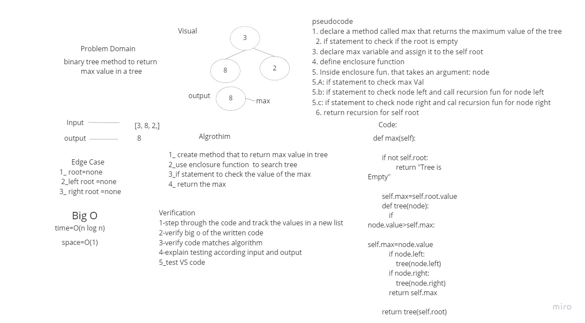
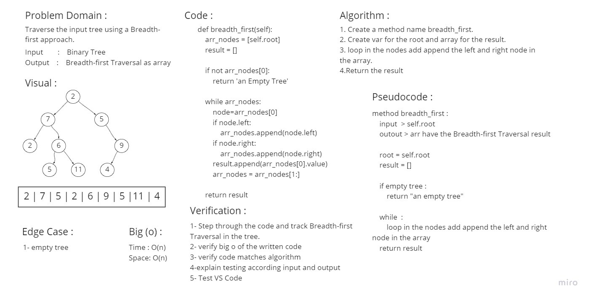

# Trees
<!-- Short summary or background information -->
### Trees Data Structure represent nodes connected by edges.

## Challenge
<!-- Description of the challenge -->

## Whiteboard Process
.
### Features

#### Node

* Create a Node class that has properties for the value stored in the node, the left child node, and the right child node.

#### Binary Tree

* Create a Binary Tree class
  * Define a method for each of the depth first traversals:
    * pre order
    * in order
    * post order which returns an array of the values, ordered appropriately.
  * Any exceptions or errors that come from your code should be semantic, capture-able errors. For example, rather than a default error thrown by your language, your code should raise/throw a custom, semantic error that describes what went wrong in calling the methods you wrote for this lab.

#### Binary Search Tree

* Create a Binary Search Tree class
  * This class should be a sub-class (or your languages equivalent) of the Binary Tree Class, with the following additional methods:
  * Add
    * Arguments: value
    * Return: nothing
    * Adds a new node with that value in the correct location in the binary search tree.
    * max value

* Contains
  * Argument: value
  * Returns: boolean indicating whether or not the value is in the tree at least once.

## Approach & Efficiency
<!-- What approach did you take? Why? What is the Big O space/time for this approach? -->
* pre order: time `O(n)`, space `O(n)`
* in order: time `O(n)`, space `O(n)`
* post order: time `O(n)`, space `O(n)`
* Add: time `O(logn)`, space `O(1)`
* Contains: time `O(logn)`, space `O(1)`
* max: time `O(n)`, space `O(1)`

## API
<!-- Description of each method publicly available in each of your trees -->
* Pre order: method that return tree in order `< root=> left=> right >`
* In order: method that return tree in order `< left=> root=> right >`
* Post order: method that return tree in order `< left=> right=> root >`
* Add: to add a value to a tree by binary search algorithm
* Contains: to check if the tree contains a value
* max: method that return max value in tree

## Solution
<!-- Show how to run your code, and examples of it in action -->

| Table Of Content                               | Links                                       |
| ---------------------------------------------- | ------------------------------------------- |
| trees                                          | [trees.py](trees/trees.py)                  |
| test_trees                                     | [test_trees.py](tests/test_trees.py)        |

# Challenge Summary : Code Challenge: Class 17 : Breadth-first Traversal.
<!-- Description of the challenge -->
### Feature Tasks

* Write a function called breadth first
* Arguments: tree
* Return: list of all values in the tree, in the order they were encountered

#### `NOTE: Traverse the input tree using a Breadth-first approach`

## Whiteboard Process
<!-- Embedded whiteboard image -->

## Approach & Efficiency
<!-- What approach did you take? Why? What is the Big O space/time for this approach? -->
* Time : `O(n)`
* Space: `O(n)`

## Solution
<!-- Show how to run your code, and examples of it in action -->
| Table Of Content                               | Links                                       |
| ---------------------------------------------- | ------------------------------------------- |
| trees                                          | [trees.py](trees/trees.py)                  |
| test_trees                                     | [test_trees.py](tests/test_trees.py)        |

